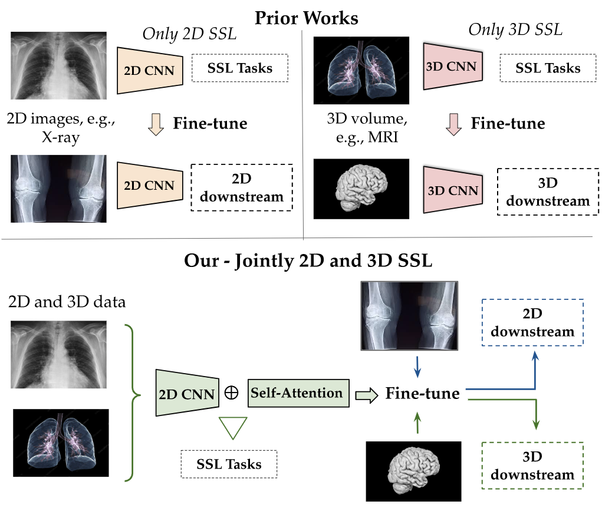

# Joint Self-Supervised Image-Volume Representation Learning with Intra-inter Contrastive Clustering

We release the algorithm in our paper accepted in [AAAI Conference on Artificial Intelligence 2023](https://ojs.aaai.org/index.php/AAAI/article/view/26687). 



## Installation

Create environment from file
```
conda env create -f env.yml
conda activate joint-ssl
```
Then install nVIDIA Apex
```
git clone https://github.com/NVIDIA/apex
cd apex
pip install -v --disable-pip-version-check --no-cache-dir --no-build-isolation --config-settings "--build-option=--cpp_ext" --config-settings "--build-option=--cuda_ext" ./
```

## Data Tree
The algorithm takes 3D images of size `H x W x C` in NPY format as inputs. An example for the folder structure of training data is given in the `Training_Data` folder. The structure must be as follows
```
Training_Data
   |
   + Dataset_1
   |    |
   |    + 001.npy
   |    + 002.npy
   |    + ...
   |
   + Dataset_2
   |    |
   |    + 001.npy
   |    + 002.npy
   |    + ...
   |
   + Dataset_3
   |    |
   |    + 001.npy
   |    + 002.npy
   |    + ...
   ...
```

## 2D SSL Training
We use [VISSL](https://github.com/facebookresearch/vissl) to train SSL methods (DeepCluster and SwAV) with 2D images.
```bash
# TODO: Instruction
```

## 3D SSL Training
First we train the mask embedding. This step requires weights from 2D SSL (included in this repository)
```bash
# For DeepCluster method
python -m torch.distributed.launch --nproc_per_node=2 mask_deepcluster.py
# For SwAV method
python -m torch.distributed.launch --nproc_per_node=2 mask_swav.py
```

Then, we train joint 2D-3D SSL. This step requires weights from 2D SSL and mask embedding training
```bash
# For DeepCluster method
python -m torch.distributed.launch --nproc_per_node=2 ssl_swav3D.py
# For SwAV method
python -m torch.distributed.launch --nproc_per_node=2 ssl_deepcluster3D.py
```

## Downstream Task
After obtaining the weights from joint 2D-3D SSL, we use this weight for downstream tasks.
```bash
# TODO: Instruction
```

## Citation
```bib
@inproceedings{nguyen2023joint,
  title={Joint self-supervised image-volume representation learning with intra-inter contrastive clustering},
  author={Nguyen, Duy MH and Nguyen, Hoang and Mai, Truong TN and Cao, Tri and Nguyen, Binh T and Ho, Nhat and Swoboda, Paul and Albarqouni, Shadi and Xie, Pengtao and Sonntag, Daniel},
  booktitle={Proceedings of the AAAI Conference on Artificial Intelligence},
  volume={37},
  number={12},
  pages={14426--14435},
  year={2023}
}
```
